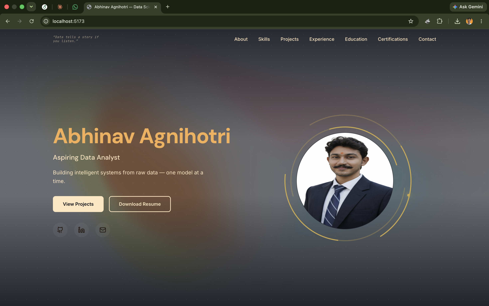
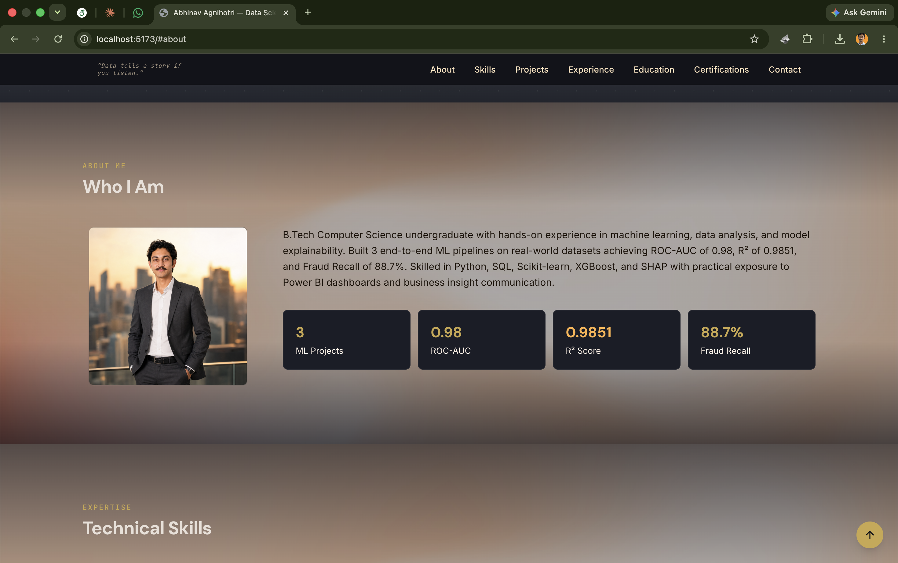
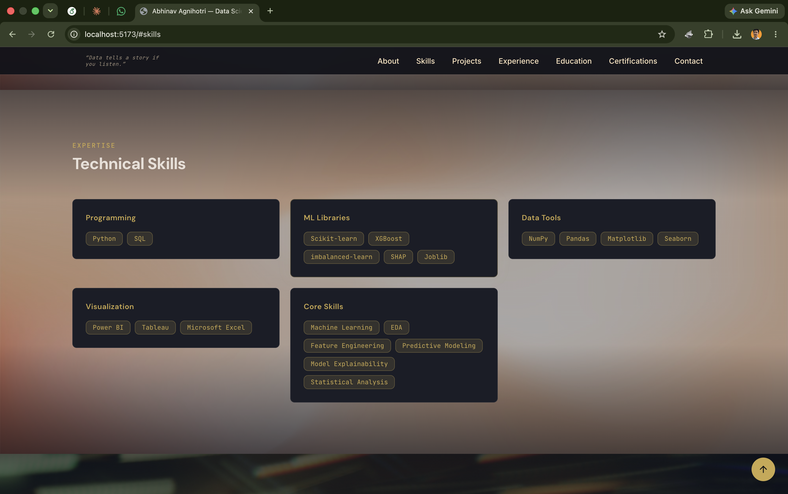
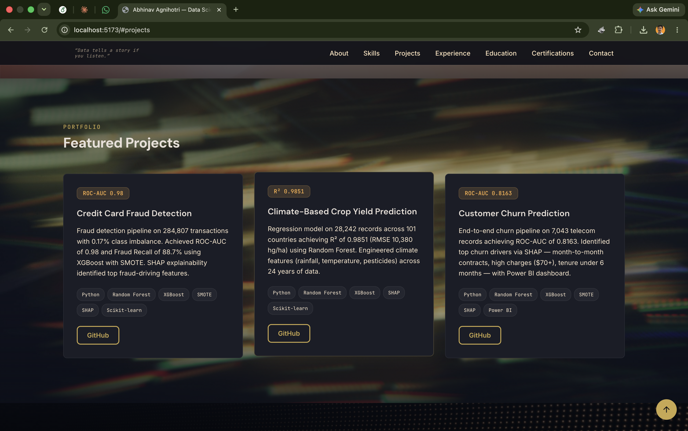
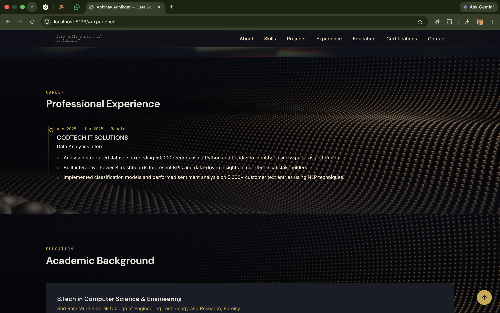
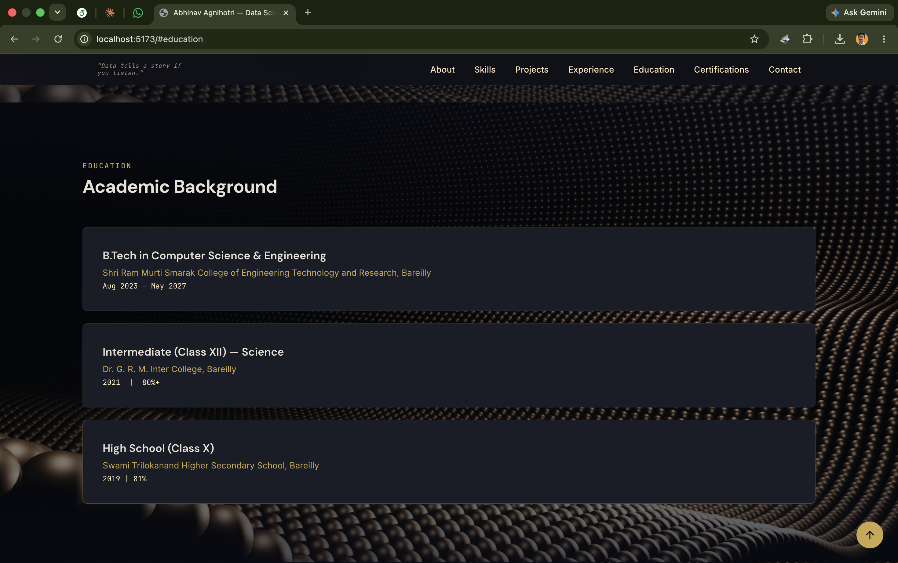
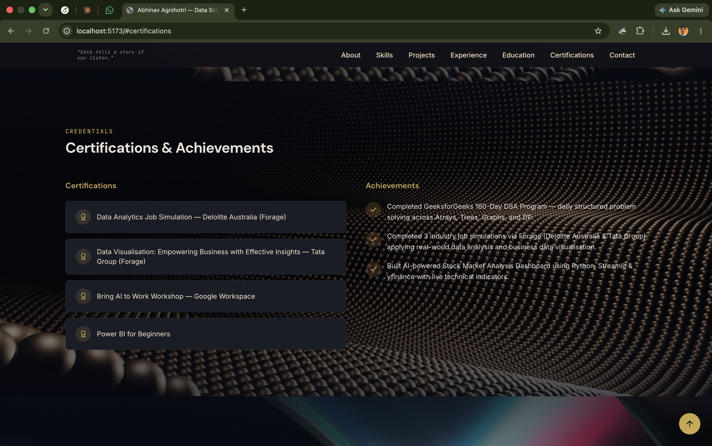
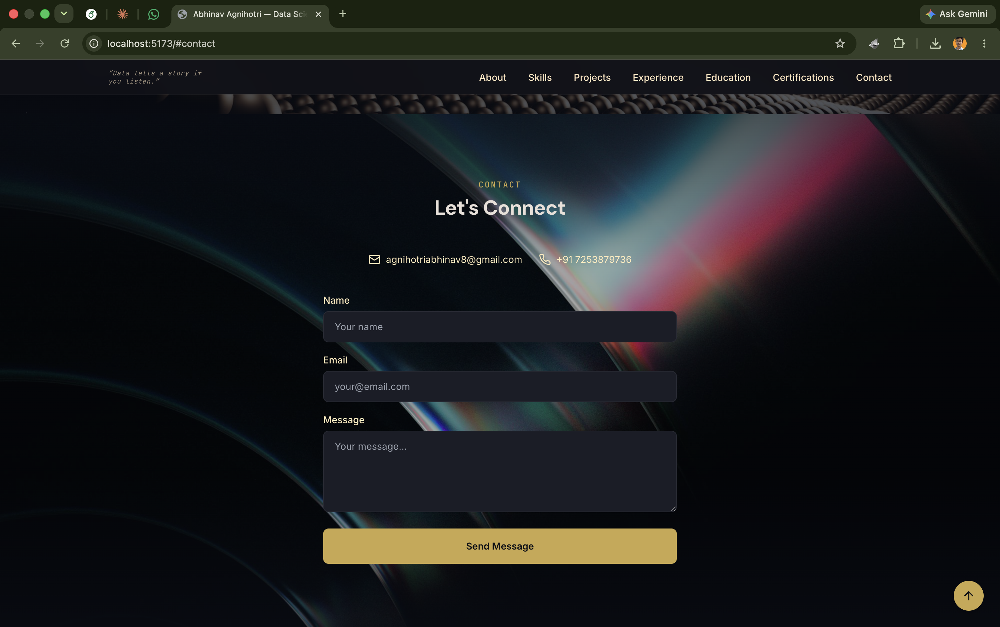

# Abhinav Agnihotri — Portfolio

> Data Science & Machine Learning Engineer

A personal portfolio website showcasing ML projects, technical skills, professional experience, and achievements. Built with React, Vite, and Tailwind CSS.



## Sections

### Hero
Animated intro with profile photo, orbital rings, social links, and CTAs.


### About
Bio and key metrics (ML projects, ROC-AUC, R-squared, Fraud Recall).



### Skills
Programming languages, ML libraries, data tools, visualization, and core competencies.



### Projects
Featured ML projects with tech stacks and GitHub links.



### Experience
CODTECH IT SOLUTIONS internship timeline.



### Education
B.Tech CSE, XII, X academic qualifications.



### Certifications & Achievements
Deloitte/Tata Forage certifications, Google AI workshop, DSA program, and more.



### Contact
Form with validation, email, and phone links.



## Tech Stack

| Category | Technology |
|---|---|
| Framework | React 18 |
| Build Tool | Vite 6 |
| Language | JavaScript (JSX) |
| Styling | Tailwind CSS 3.4 |
| Icons | Lucide React |
| Fonts | Inter, DM Sans, JetBrains Mono (Google Fonts) |
| Animations | CSS keyframes + IntersectionObserver |
| Utilities | clsx, tailwind-merge |

## Getting Started

```bash
npm install
npm run dev        # development server (HMR)
npm run build      # production build → dist/
npm run preview    # preview production build
```

## Project Structure

```
src/
├── main.jsx                  # Entry point
├── App.jsx                   # Root component
├── index.css                 # Tailwind directives + theme
├── lib/
│   └── utils.js              # cn() helper
├── hooks/
│   └── use-mobile.jsx        # IntersectionObserver + mobile detect
└── components/
    ├── Header.jsx
    ├── HeroSection.jsx
    ├── AboutSection.jsx
    ├── StatCard.jsx
    ├── SkillsSection.jsx
    ├── SkillCard.jsx
    ├── ProjectsSection.jsx
    ├── ProjectCard.jsx
    ├── ExperienceSection.jsx
    ├── EducationSection.jsx
    ├── CertificationsSection.jsx
    ├── CertificationCard.jsx
    ├── ContactSection.jsx
    ├── Footer.jsx
    └── ScrollToTop.jsx
```

## Deployment

Build to `dist/` and deploy to any static host:

```bash
npm run build
```

Supports Netlify, Vercel, GitHub Pages, Cloudflare Pages, etc.

## License

MIT
